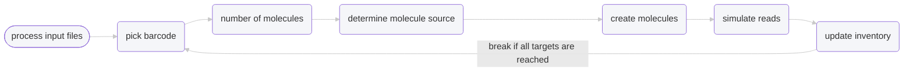

# The simulation process
Or algorithm, if you want to be fancy about it. Note that mentions of "contig" below are synonymous with
"chromosome" if your input FASTA files are chromosome-scale.

Mimick 2.0 had a complete overhaul that rewrote the entire simulation process and we detail that process below.
This description will ignore all the checks and validations Mimick does before beginning simulation because it's
more of a user-experience technical detail and not directly relevant to simulation itself.

### Step 0: Parse the FASTA file(s)
The FASTA files are processed into schema that contain characteristics for each contig, along with the
sequence in it. These schema are part of the recipes that get processed during simulation. Schema contain information
such as the sequence length (adjusted for ambiguous bases), haplotype number, reads per molecule, and other important
information on what needs to be done for that contig (or interval) for that haplotype. They also contain the target number
of reads for that contig for that haplotype and a tracker for how many reads have already been generated. These schema
are also used to generate the molecule recipes that get fed into the read simulator (wgsim). Mimick accepts an option BED 
file of intervals, which would restrict the schema to those intervals; if a BED file isn't provided (totally fine), Mimick
assumes you want every contig of your FASTA file(s) to have reads simulated. So, if you have two FASTA files,
each with 3 contigs and no BED file suggesting otherwise, Mimick will produce 2 * 3 schema (`haplotypes * contigs`).
The schema are internal objects held in memory, not files you will be able to browse.

## The loop
### Step 1: Pick a barcode
Whether you chose to have barcodes generated or provided your own, Mimick picks the first one and also generates
an output version of it. Since input barcodes are always nucleotides, the barcodes will have a corresponding haplotagging or
stLFR analogue created if that's the desired output. You can think of the barcode as the oligo-covered bead in TELLseq/stLFR/haplotagging
chemistries.

### Step 2: Making the molecule recipes
Based on the `--molecules-per` parameter, Mimick will decide how many unrelated molecules will be associated with the barcode.
Then, it's a matter of randomly choosing (with replacement) which schema to make molecules from. Remember, each contig for each
haplotype has its own schema, so unrelated molecules can come from anywhere, which is a very important feature of these simulations.
At this stage, the "molecules" are just recipes describing which contig/haplotype, which section of it, how many paired
reads need to be generated from it to meet `--molecule-coverage` targets, etc.

### Step 3: Submitting the molecule recipes for simulation
This is the part that's multithreaded. Once we have a molecule recipe and its associated schema, Mimick submits the use-wgsim-to-create-reads-from-this
task to the thread pool. This task will interpret the molecule recipe and create a fasta file from it. The fasta file will then be the input "genome" into
`wgsim`, which will randomly generate the target number of reads for that molecule.

### Step 4: Monitor schema targets
The number of reads that were generated for every molecule are added to that molecule's source schema to track the number of reads already produced for
that contig for that haplotype. Once a schema reaches its reads target, that schema will be removed from the list of schema that are randomly sampled
to determine molecules in [Step 2](#step-2-making-the-molecule-recipes). This ensures that read `--coverage` is honored.

### Step 5: Repeat until all schema read targets are met
Once there are no more schema left to sample, simulation is done!
